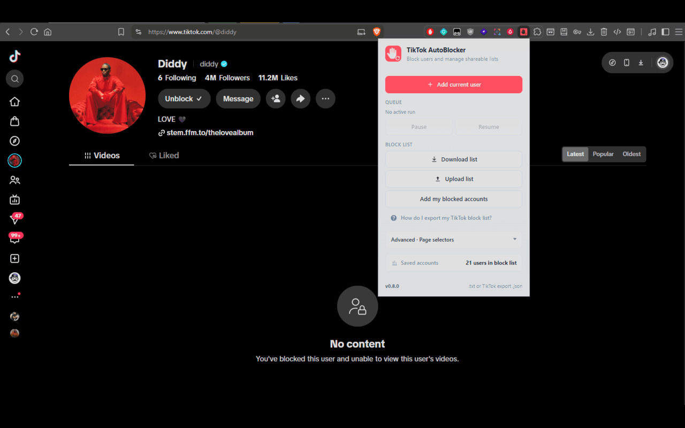

# TikTok AutoBlocker


<p>
  
</p>

A powerful tool for mass blocking TikTok users with support for both Chrome extensions and Tampermonkey scripts. Features enhanced private account detection, real-time status updates, and robust error handling. **Now Available on Chrome Web Store!!**

## 🚀 Features

### Core Functionality

- **Mass Blocking**: Upload text files with usernames and automatically block them all
- **Private Account Support**: Automatically detects and handles private TikTok accounts
- **Real-time Status Updates**: Live progress feedback during blocking operations
- **Enhanced Error Handling**: Gracefully handles deleted, banned, or inaccessible accounts
- **Block List Management**: Add users, download blocklists, and upload existing lists
- **Add accounts you have already blocked**: On [tiktok.com/setting/block-list](https://www.tiktok.com/setting/block-list), **Add my blocked accounts** appends those usernames to your saved list. Names you added yourself stay, and blocking does not start

### Advanced Features

- **3-Step Blocking Process**: Reliable blocking sequence that works with TikTok's current interface
- **Account Accessibility Detection**: Smart detection of accessible vs. inaccessible accounts
- **Multiple URL Pattern Support**: Handles various TikTok URL formats
- **Comprehensive Logging**: Detailed console output for debugging and monitoring
- **Queue Management**: Robust task queue system for processing large lists
- **Pause / Resume**: Stop after the current profile; remaining count on the extension badge
- **Cross-browser Compatibility**: Tampermonkey version works in Chrome, Firefox, Safari, Edge, and more

## 📁 Project Structure

```text
tiktok-autoblocker/
├── chrome-extension/       # Chrome extension version
│   ├── manifest.json       # Extension configuration
│   ├── content.js          # Content script for TikTok pages
│   ├── page-world.js       # Page-side click helper used by TikTok's own buttons
│   ├── popup.html          # Popup interface
│   ├── popup.js            # Popup logic
│   ├── background.js       # Background service worker
│   ├── icons/              # Extension icons
│   └── INSTALL.md          # Installation guide
├── tampermonkey/           # Tampermonkey script version
│   ├── script.js           # Main Tampermonkey script
│   └── test-blocklist.txt  # Test blocklist file
├── README.md               # This file
└── test-blocklist.txt      # Sample blocklist for testing
```

## 🛠️ Installation Options

### Option 1: Chrome Extension (Recommended)

- **Pros**: Modern UI, integrated popup, persistent storage, available on Chrome Web Store
- **Cons**: Requires Chrome browser

#### Installation from Chrome Web Store (Easiest)

1. Visit [TikTok AutoBlocker on Chrome Web Store](https://chromewebstore.google.com/detail/tiktok-autoblocker/aimhdnemlhpkecbdhgclkckcfgpgolln)
2. Click "Add to Chrome"
3. Confirm the installation
4. The extension will appear in your browser toolbar

#### Development Installation

1. **Download the extension files**
   - Clone or download this repository
   - Navigate to the `chrome-extension` folder

2. **Create required icons**
   - Convert `icons/icon.svg` to PNG format
   - Create `icon16.png` (16x16), `icon48.png` (48x48), and `icon128.png` (128x128)
   - Place them in the `icons/` folder

3. **Install in Chrome**
   - Open Chrome and navigate to `chrome://extensions/`
   - Enable "Developer mode" in the top right corner
   - Click "Load unpacked" and select the `chrome-extension` folder
   - The extension should now appear in your extensions list

### Option 2: Tampermonkey Script

- **Pros**: Works in any browser with Tampermonkey, lightweight
- **Cons**: Requires Tampermonkey extension

#### Prerequisites

Before you can use the TikTok AutoBlocker script, you must install Tampermonkey. Tampermonkey is a popular userscript manager that's available as a browser extension.

**Installing Tampermonkey:**

**Chrome:**

1. Visit [Chrome Web Store - Tampermonkey](https://chrome.google.com/webstore/detail/tampermonkey/dhdgffkkebhmkfjojejmpbldmpobfkfo)
2. Click "Add to Chrome"
3. Confirm the installation

**Firefox:**

1. Visit [Firefox Add-ons - Tampermonkey](https://addons.mozilla.org/en-US/firefox/addon/tampermonkey/)
2. Click "Add to Firefox"
3. Confirm the installation

**Other Browsers:**

- Search for "Tampermonkey" in your browser's extension store
- Follow the installation instructions for your specific browser

#### Installing the Script

Once Tampermonkey is installed, follow these steps:

1. **Open Tampermonkey Dashboard**
   - Click the Tampermonkey icon in your browser toolbar
   - Select "Dashboard" or "Create a new script"

2. **Create New Script**
   - Click "Create a new script" in the Tampermonkey dashboard
   - This will open the script editor

3. **Copy the Script**
   - Open the file `tampermonkey/script.js` from this repository
   - Copy the entire contents of the file

4. **Paste and Save**
   - Paste the copied script into the Tampermonkey script editor
   - Press `Ctrl + S` (or `Cmd + S` on Mac) to save the script
   - The script should now be enabled and ready to use

## 📥 Getting Your Existing Blocked List from TikTok

If you already have many blocked accounts on TikTok (e.g. 1500+) and want to use that list in the extension (e.g. to block the same people on another account), you have two options:

### Option 1: TikTok “Download your data” (recommended)

TikTok’s **full data archive** can include a **Block List** (date + username). To get it:

1. In the **TikTok app**: Profile → **Menu (☰)** → **Settings and privacy** → **Account** → **Download your data**.
2. Request your data and choose the **full archive** (or ensure “Block list” / blocked accounts are included if TikTok lets you pick categories).
3. When TikTok emails you (often within a few days), download the ZIP they provide.
4. Open the ZIP and look for a file related to **Block list** or **blocked accounts** (e.g. `Block list.txt`, `blocked_accounts.json`, or similar — names may vary by region/version).
5. If the file is **one username per line** (or one per line in a column), save it as a `.txt` and use **Upload Block List (.txt)** in the extension.
6. If the file is **JSON** (e.g. `[{"date":"...","username":"..."}]`), use the extension’s **Upload Block List** and choose the JSON file — the extension can parse TikTok-style export files. Or copy the `username` values into a plain text file, one per line, and upload that.

*Note: If your export doesn’t include a block list, request the full archive; the Block List is part of the full archive in TikTok’s data portability.*

### Option 2: Add accounts you have already blocked

While logged in on TikTok web:

1. Open [tiktok.com/setting/block-list](https://www.tiktok.com/setting/block-list).
2. Click the extension icon, then **Add my blocked accounts**. The userscript card has the same button.
3. Click **Download Block List** to save the `.txt` file.

That button appends the usernames from TikTok's Blocked accounts page. Names you added yourself stay in the list. Click it again after you block more people and only the new names are added. Download Block List writes the whole saved list. It does not start blocking. If the page is empty, use Option 1.

---

## 📋 Usage

### File Format

Your blocklist text file should contain usernames, one per line:

```txt
@kimkardashian
@diddy
@jlo
@username1
@username2
```

### Chrome Extension Usage

#### Adding Users to Block List

1. Navigate to any TikTok user's profile page
2. Click the TikTok AutoBlocker extension icon in your browser toolbar
3. Click "Add Current User to Block List" to add them to your blocklist

#### Downloading Your Block List

1. Click the extension icon
2. Click "Download Block List" to download your current blocklist as a .txt file

#### Add accounts you have already blocked

1. While logged in, open [tiktok.com/setting/block-list](https://www.tiktok.com/setting/block-list)
2. Click the extension icon, then **Add my blocked accounts**
3. Those usernames are appended to your saved list. **Download Block List** saves all of them, including ones you added yourself

#### Mass Blocking Users

1. Create a text file with one username per line (e.g., `@username1`, `@username2`)
2. Click the extension icon
3. Click "Upload Block List (.txt)" and select your file
4. The extension will automatically start blocking all users in the list

### Tampermonkey Script Usage

#### Adding Users to Block List

1. Navigate to any TikTok user's profile page
2. Look for the "TikTok AutoBlocker" card in the top-right corner of the page
3. Click "Add User to Block List" to add the current user to your blocklist

#### Downloading Your Block List

1. On any TikTok page, find the TikTok AutoBlocker card
2. Click "Download Block List" to download your current blocklist as a .txt file
3. The file will be saved to your default downloads folder

#### Add accounts you have already blocked

1. While logged in, open [tiktok.com/setting/block-list](https://www.tiktok.com/setting/block-list)
2. On the TikTok AutoBlocker card, click **Add my blocked accounts**
3. Those usernames are appended to your saved list. **Download Block List** saves all of them, including ones you added yourself

#### Mass Blocking Users

1. **Create a blocklist file**
   - Create a text file with one username per line
   - Example format:

     ```text
     @kimkardashian
     @diddy
     @jlo
     @username1
     @username2
     ```

2. **Upload and process**
   - Navigate to any TikTok page
   - In the TikTok AutoBlocker card, click "Upload Block List (.txt)"
   - Select your text file
   - The script will automatically start blocking all users in the list

### Basic Workflow

1. **Create a blocklist**: Add usernames to a text file
2. **Upload the file**: Use the upload feature in either version
3. **Monitor progress**: Watch real-time status updates
4. **Download results**: Save your blocklist for future use

## 🔌 Compatibility

- **TikTok web**: The extension is built for TikTok’s website (`*.tiktok.com`). It relies on page structure (e.g. `[data-e2e="user-more"]`, Block/Unblock buttons). If TikTok changes their HTML or layout, blocking may stop working until the extension is updated.
- **Current status**: Tested with TikTok web as of 2025. If you see “Could not find more options button” or blocking never starts, TikTok may have changed their UI — open an issue with your region and what you see on profile pages.
- **Chrome**: Manifest V3; requires Chrome (or a Chromium-based browser that supports the same extension APIs).

## 🔧 Technical Details

### Architecture

**Chrome Extension:**

- **Manifest V3**: Uses the latest Chrome extension manifest version
- **Content Script**: Runs on TikTok pages to handle blocking operations
- **Popup Interface**: Modern UI for user interactions
- **Background Service Worker**: Handles extension lifecycle and background tasks
- **Chrome Storage**: Uses chrome.storage.local for data persistence

**Tampermonkey Script:**

- **Cross-browser Compatibility**: Works in Chrome, Firefox, Safari, Edge, and more
- **Local Storage**: Uses localStorage for data persistence
- **Content Script**: Runs directly on TikTok pages
- **UI Integration**: Integrates with TikTok's page layout

### Blocking Process

Both versions use a 3-step blocking sequence. Checked against TikTok web on September 21, 2026, including a logged-in profile:

1. **Open Actions** (`button[data-e2e="user-more"]`, aria-label `Actions`)
2. **Choose Block** (`div[role="button"][aria-label="Block"]`, inside `[data-e2e="user-report"]`). If that row says **Unblock**, the profile is already blocked on TikTok and the queue moves on.
3. **Confirm** (`button[data-e2e="block-popup-block-btn"]`). Cancel is `button[data-e2e="block-popup-cancel-btn"]`.

A plain element click does not open that menu. TikTok draws it from the button's React handler, and the extension reaches that handler through `page-world.js`. The script waits until the live Actions button is hydrated, which matters on large profiles that replace the first button they paint.

If TikTok changes those controls, open **Page selectors** in the extension popup or the userscript card. **Blocking a profile** is the Actions, Block, and Confirm controls. **Blocked accounts page** is the username element on `tiktok.com/setting/block-list` (`h3[data-e2e="block-user-username"]`). Pick the new element and save. Empty fields keep the built-in selectors. Profile links are always opened as `https://www.tiktok.com/@username`, including lists that omit the `@`.

### Private Account Detection

Advanced detection for private accounts:

- DOM element indicators (`[data-e2e="private-account"]`)
- Text content analysis ("This account is private")
- User subtitle detection ("Private")
- Multiple fallback strategies

### Error Handling

- **Inaccessible accounts**: Automatically skipped with logging
- **Failed blocking**: The queue continues. A missing Block row is not reported as "already in the block list."
- **Network issues**: Retry mechanisms and graceful degradation
- **Queue management**: Continues processing even if some accounts fail
- **@N/A username protection**: Prevents infinite refresh loops when encountering invalid usernames

### URL Pattern Support

Both versions handle various TikTok URL formats:

- `/@username` (with @ symbol)
- `/username` (without @ symbol)
- `/user/username` (alternative format)
- Fallback for any TikTok page

## 🐛 Troubleshooting

### Chrome Extension Issues

**Extension not loading:**

- Make sure all required files are present
- Check that the `manifest.json` file is valid JSON
- Ensure icons are in PNG format and the correct sizes
- Check Chrome's extension page for error messages

**`Identifier 'blockListKey' has already been declared`:**

- That error means the content script was injected twice into the same page. Reload the extension at `chrome://extensions/`, then refresh the TikTok tab.
- Turn off the Chrome Web Store copy if you also have this folder loaded unpacked. Two copies both inject a script and the page stops working.

**Extension not working on TikTok:**

- Make sure you're on a TikTok page (tiktok.com domain)
- Check the browser console for any error messages
- Try refreshing the TikTok page
- Ensure the extension has the necessary permissions

**Blocking not working:**

- Reload the extension at `chrome://extensions/`, then refresh the TikTok tab. `page-world.js` loads with the page, so a reload alone is not enough.
- Ensure you're on a TikTok profile page
- "Could not find block option" means the Actions menu did not show a Block row. Large profiles can paint that button before it is clickable; the current script waits for the live button.
- The saved list is in the extension's `chrome.storage.local` (`tiktokBlockList`), not the page's `localStorage`. The page console cannot read `chrome.storage`.

### Tampermonkey Script Issues

**Script not appearing on TikTok pages:**

1. Re-copy `tampermonkey/script.js` into Tampermonkey and save it. `@grant unsafeWindow` runs the script in Tampermonkey's sandbox, so TikTok's page content security policy does not block it. `@grant none` injects into the page and the script never appears.
2. Check if Tampermonkey is installed and enabled
3. Verify the script is enabled in Tampermonkey dashboard
4. Check browser console for error messages
5. Try refreshing the TikTok page

**Blocking not working:**

1. Ensure you're on a TikTok profile page
2. Check console logs for detailed error information
3. Look for the red test box that appears for 5 seconds
4. Verify the UI card appears in the top-right corner

**Script not loading:**

1. Check Tampermonkey dashboard for script errors
2. Verify the script is saved and enabled
3. Try reinstalling the script
4. Check browser console for JavaScript errors

### Debug Features

Both versions include comprehensive debugging:

- **Page structure analysis**: Analyze current page elements
- **Step-by-step blocking tests**: Test the blocking process manually
- **Debug log export**: Export detailed logs to file
- **Real-time status monitoring**: Live progress feedback
- **Clear stuck tasks**: Reset the blocking queue if needed

### Getting Help

If you're still having issues:

1. Check the browser console for error messages
2. Review the console logs for detailed error information
3. Try the debug features to analyze page structure
4. Open an issue on the GitHub repository with detailed information

## 📈 Version History

### v0.8.0

- Pause and Resume for an active block run (finishes the current profile, then stops).
- Remaining queue count on the Chrome extension toolbar badge (gray while paused).
- Queue status and Pause / Resume controls in the extension popup and Tampermonkey panel.

### v0.7.0

- **Add my blocked accounts** appends the usernames on `tiktok.com/setting/block-list` to the saved list. It does not replace names you added yourself and it does not start blocking.
- Those usernames are read from the heading text (`h3[data-e2e="block-user-username"]`). Page selectors split **Blocking a profile** from **Blocked accounts page**.
- `@name` and `name` count as the same person.
- The userscript no longer uses `@inject-into`. `@grant unsafeWindow` keeps it in Tampermonkey's sandbox so TikTok's page content security policy does not block it.

### v0.6.1

- Fixed the content script so a second injection no longer throws `Identifier 'blockListKey' has already been declared`.
- Tampermonkey now injects outside the page so TikTok's content security policy does not block it from starting.
- Blocking calls TikTok's React handler through `page-world.js` and waits for the live Actions button before opening Block.
- Uploaded usernames open `/@username`.
- Page selector overrides can be picked and saved in the extension popup and the userscript card.
- A failed attempt to find Block is no longer announced as "already in the block list."

### v0.6.0

- ✅ **Getting your blocked list from TikTok**: Docs and popup help for using TikTok “Download your data” to export your block list and use it in the extension.
- ✅ **JSON import**: Upload TikTok-style data export files (e.g. block list JSON) in addition to .txt.
- ✅ **Compatibility**: Documented TikTok web compatibility and what to do if the site changes.

### v0.3.0

- ✅ Enhanced private account detection
- ✅ Improved 3-step blocking sequence
- ✅ Better error handling and accessibility checks
- ✅ Multiple URL pattern support
- ✅ Comprehensive logging and debugging
- ✅ Robust queue management
- ✅ Real-time status updates
- ✅ @N/A username protection to prevent infinite refresh loops
- ✅ Updated block button selectors for improved reliability

### v0.2.0

- ✅ Private account support
- ✅ Real-time status updates
- ✅ Enhanced error handling
- ✅ Modern UI design

### v0.1.0

- ✅ Basic blocking functionality
- ✅ File upload/download
- ✅ Simple UI

## 🔒 Security & Privacy

- **Local Storage**: All data is stored locally in your browser
- **No External Servers**: Neither version sends data to any external servers
- **Open Source**: Full source code is available for review
- **Privacy Focused**: No tracking or data collection

## 📄 License

This project is licensed under the MIT License.

## ⚠️ Disclaimer

This tool is intended for personal use and should be used responsibly. The creators are not responsible for any misuse or consequences arising from the use of this tool. Please respect TikTok's terms of service and use this tool ethically.

## 🤝 Contributing

Contributions are welcome! Please feel free to submit issues, feature requests, or pull requests.

## 📞 Support

For support, please:

1. Check the troubleshooting section above
2. Review the console logs for error messages
3. Open an issue on the GitHub repository with detailed information
